# Goal Tracker Dashboard

## Description

A React-based goal tracking application that allows users to create goals, track progress, earn XP, maintain streaks, and manage goals through a responsive dashboard.

## 🚀 Features Checklist

* [x] Create Goal
* [x] Edit Goal
* [x] Delete Goal
* [x] View Goal Details
* [x] Progress Tracking
* [x] Automatic Goal Completion
* [x] XP System
* [x] Streak System
* [x] Dashboard Summary
* [x] Categories Overview
* [x] Search Goals
* [x] Filter Goals
* [x] Sort Goals
* [x] Light/Dark Theme
* [x] English/Persian Languages
* [x] RTL/LTR Layout Switching
* [x] LocalStorage Persistence
* [x] Responsive Design
* [x] Custom 404 Page
* [x] Export Goals (JSON)
* [x] Restore Completed Goals

---

## How to Run

Install dependencies:

```bash
npm install
```

Start development server:

```bash
npm run dev
```

Build project:

```bash
npm run build
```

---

## Language & RTL/LTR Support

The application supports two languages:

* English (LTR)
* Persian (RTL)

Changing the language automatically updates the layout direction of the application.

---

## Streak Rules

* First progress log starts a streak of 1.
* Logging progress on the next consecutive day increases the streak.
* Missing one or more days resets the streak to 1.
* Multiple logs on the same day do not increase the streak.

---

## XP Rules

* Each progress update awards 20 XP.
* XP is accumulated and displayed on the Dashboard.

---

## Screenshots

### Desktop

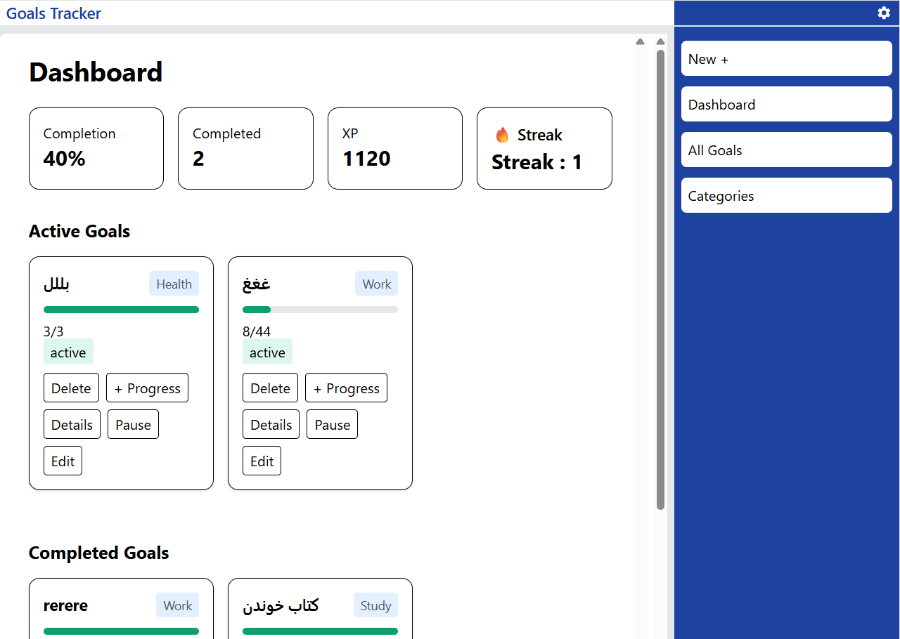,
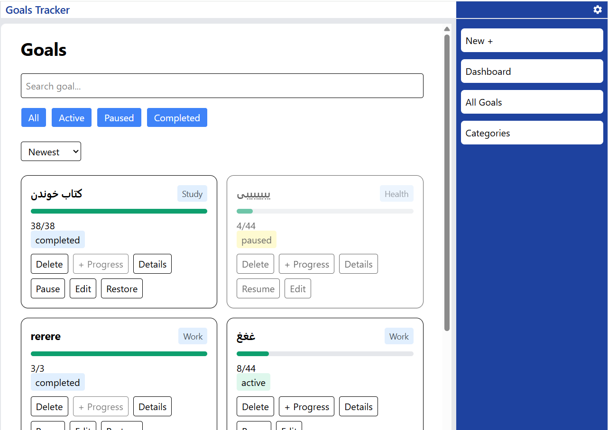,
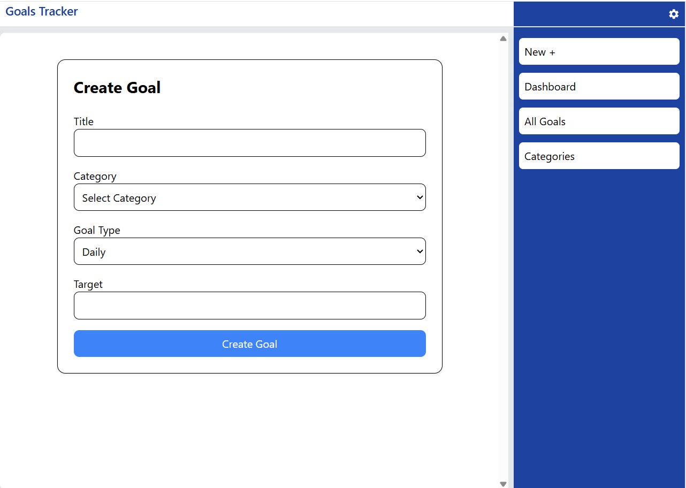,
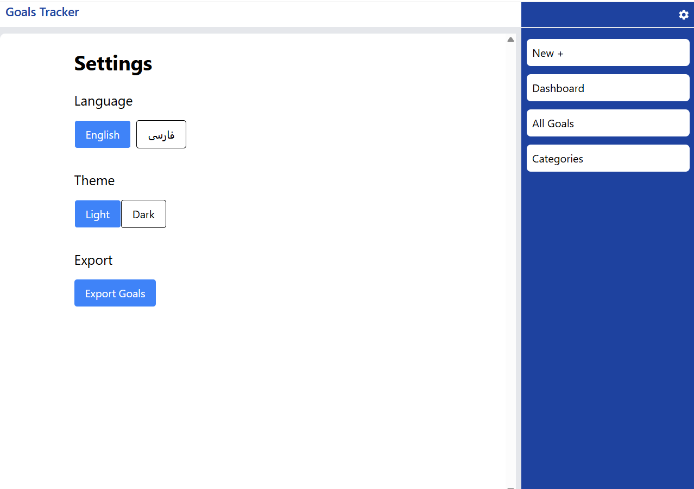,
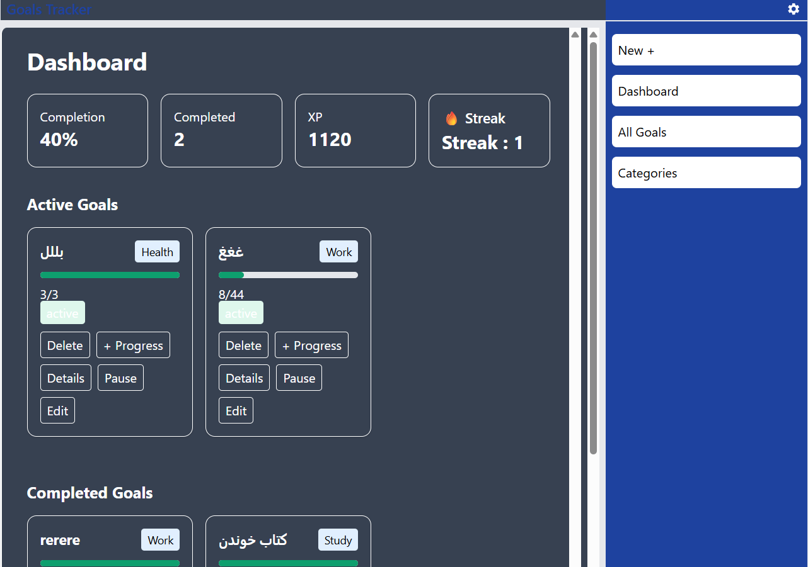,

### Mobile

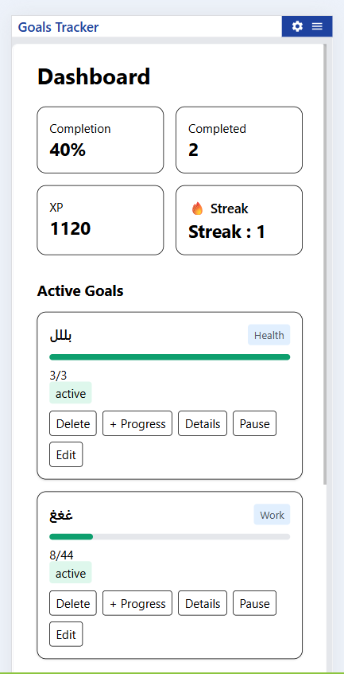,
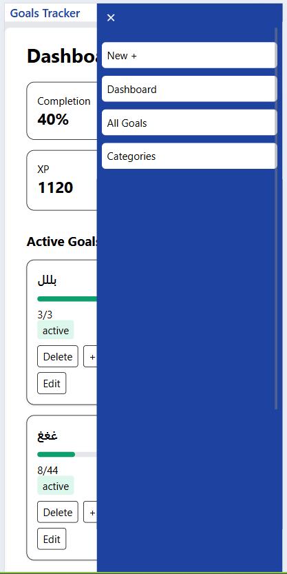,
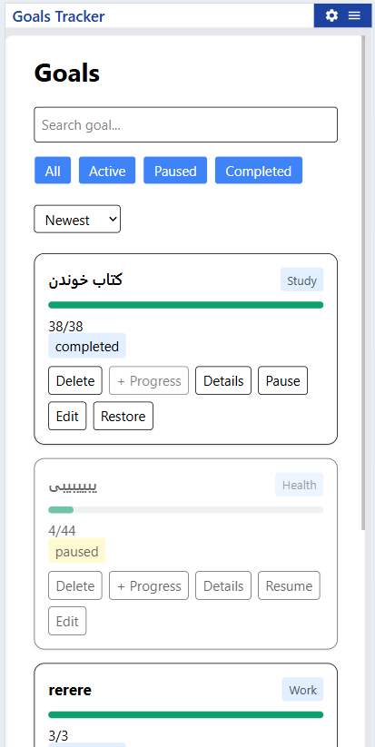,
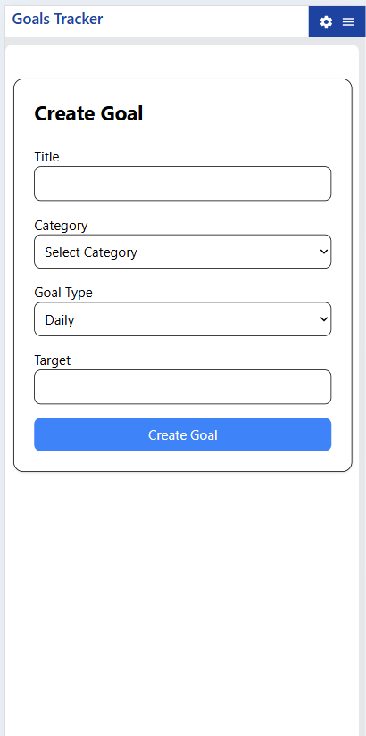,
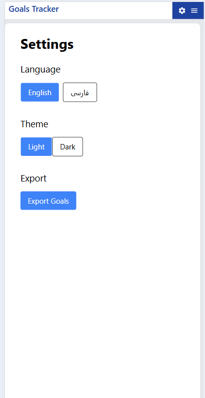,
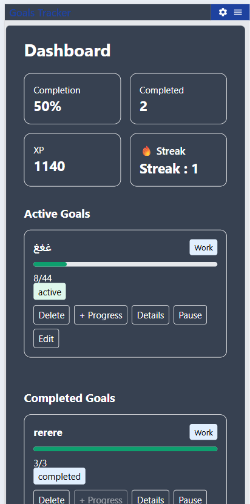
